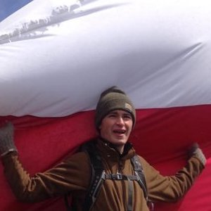

"Alex atop Cerro Bandera in Puerto Williams, Chile (January, 2014)"
##	About	Me	
I	am	a	MS student	in	the	UConn	Department of Ecology and 
Evolutionary Biology	interested	genome evolution and bioinformatics.	
[My	CV](PDFs/cv.pdf)	
[Contact	Info](contact-info.html)
